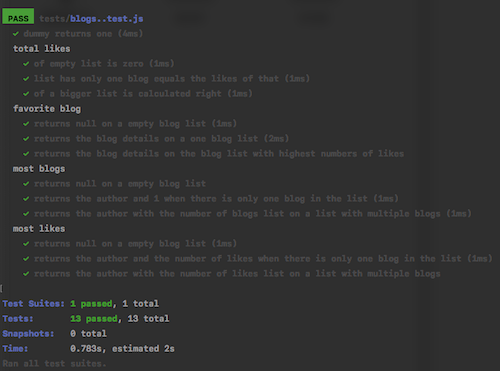
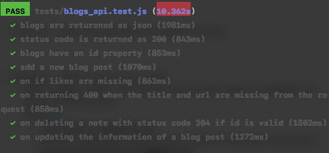

# Exercises

- 4.1 Blog list - turn an application body into a functioning npm project.
  - config `nodemon`
  - create a database
  - test the backend make sure all endpoints work correctly

#

- 4.2 Bolg list - refactor the application into separate modules

#

- 4.3 Bolg list - helper functions and unit tests
  - define a `dummy` function that receives an array of blog posts as a parameter and always returns the value 1.
  - install [jest](https://jestjs.io/)
    - `npm install --save-dev jest`
    - define the `npm script` `test` to execute tests with Jest and to report about the test execution with the `verbose` style
      - `"test": "jest --verbose"` in the `script` of the `package.json`
    - specify that the execution environment is Node (package.json)
      ```javascript
        "jest": {
          "testEnvironment": "node"
        }
      ```
    - or create a configuration file with the default name `jest.config.js`
      ```javascript
      module.exports = {
        testEnvironment: "node"
      };
      ```
    - the `.eslintrc.js`
      ```javascript
        module.exports = {
        "env": {
          "commonjs": true
          "es6": true,
          "node": true,
          "jest": true,  },
        "extends": "eslint:recommended",
        "rules": {
          // ...
        },
      };
      ```

#

- 4.4 Bolg list - helper functions and unit tests
  - define a new `totalLikes` function that receives a list of blog posts as a parameter. The function returns the total sum of likes in all of the blog posts.
  - **tips**
    - run a single test with [only](https://jestjs.io/docs/en/api.html#testonlyname-fn-timeout) method
    - run a single test with [-t flag](https://jestjs.io/docs/en/cli.html)
      - `npx jest -t 'when list has only one blog equals the likes of that'`

#

- 4.5 Bolg list - helper functions and unit tests

  - define a new `favoriteBlog` function that receives a list of blogs as a parameter. The function finds out which blog has most likes. If there are many top favorites, it is enough to return one of them.

#

- 4.6, 4.7 Bolg list - helper functions and unit tests
  - can use `lodash`
  - define a function called `mostBlogs` that receives an array of blogs as a parameter. The function returns the author who has the largest amount of blogs.
  - define a function called `mostLikes` that receives an array of blogs as its parameter. The function returns the author, whose blog posts have the largest amount of likes.

#

  <p align="center">
    
  </p>

#

- 4.8 Blog list tests

  - write a test that makes an **HTTP GET** request to the `/api/blogs url`. Verify that the blog list application returns the correct amount of blog posts in the JSON format.
  - refactor the route handler to use the async/await syntax instead of promises.

  ##### --

  **- modify the way that our application runs in different modes so that we could define the application to use a separate test databse when it's running tests**

  - set up `NODE_DEV` in package.json

  ```javascript
    "start": "cross-env NODE_ENV=production node index.js",
    "watch": "cross-env NODE_ENV=development nodemon index.js",
    "test": "cross-env NODE_ENV=test jest --verbose --runInBand"
  ```

  - [runInBand](https://jestjs.io/docs/en/cli.html#--runinband) - prevent Jest from running tests in parallel.
  - [cross-env](https://www.npmjs.com/package/cross-env)
  - change configuration in `.config.js` (separate prod and testing env)
    ```javascript
    if (process.env.NODE_ENV === "test") {
      MONGODB_URI = process.env.TEST_MONGODB_URI;
    }
    ```
  - [supertest](https://github.com/visionmedia/supertest) - install it as a dev dependency for testing API
  - [afterAll](https://jestjs.io/docs/en/api.html#afterallfn-timeout) method
  - error handling - [jest mongoose error handleing](https://mongoosejs.com/docs/jest.html)

    - add a `jest.config.js` file

      ```javascript
      module.exports = {
        testEnvironment: "node"
      };
      ```

  - The tests only use the express application defined in the app.js file, and the `supertest` takes care that the application being tested is started at the port that it uses internally.

  ```javascript
  const mongoose = require("mongoose");
  const supertest = require("supertest");
  const app = require("../app");
  const api = supertest(app);
  // ...
  ```

#

- 4.9 Blog list tests

  - write a test that verifies that the unique identifier property of the blog posts is named id, by default the database names the property `_id`.
  - verify the existence of a property is easily done with Jest's [toBeDefined](https://jestjs.io/docs/en/expect#tobedefined) matcher

  ##

  - Initialising the database before running tests
  - [beforeEach](https://jestjs.io/docs/en/api.html#beforeeachfn-timeout) - executing operations once before any test is run, or every time before a test is run.

  - [toContain](https://jestjs.io/docs/en/expect.html#tocontainitem)

  - `npx jest -t "blogs"` - run all of the tests that contain blogs in their name

#

- 4.10 Blog list tests
  - write a test that verifies that making an **HTTP POST** request to the `/api/blogs`url successfully creates a new blog post.
  - verify that the total number of blogs in the system is increased by one.
  - also verify that the content of the blog post is saved correctly to the database.

#

- 4.11 Blog list tests
  - write a test that verifies that if the `likes` property is missing from the request, it will default to the value 0.

#

- 4.12 Blog list **tests**
  - write a test related to creating new blogs via the `/api/blogs` endpoint, that verifies that if the `title` and `url` properties are missing from the request data, the backend responds to the request with the status `code 400 Bad Request`.

#

- 4.13 Blog list tests
  - implement functionality for deleting a single blog post resource.
  - use async/await and follow REST API conventions when defining the HTTP API

#

- 4.14 Blog list tests
  - implement functionality for updating the information of an individual blog post.
  - use async/await

#

  <p align="center">
    
  </p>

#

### User administration

- [Mongo lookup aggregation queries](https://docs.mongodb.com/manual/reference/operator/aggregation/lookup/)
- schema-less databases require developers to make far more redical design decisions about data organisation at the beginning of the project than relational databases

```javascript
notes: [
  {
    type: mongoose.Schema.Types.ObjectId,
    ref: "Note"
  }
];
```

###

- handling passwords
  - [storing password](https://codahale.com/how-to-safely-store-a-password/)
  - [saltRounds](https://github.com/kelektiv/node.bcrypt.js/#a-note-on-rounds)
  - [one-way hash function](https://en.wikipedia.org/wiki/Cryptographic_hash_function)
  - [node-bcrypt](https://github.com/kelektiv/node.bcrypt.js)
  - [mongoose-unique-validator](https://www.npmjs.com/package/mongoose-unique-validator) - for checking the uniqueness of a field
  ```javascript
    const uniqueValidator = require('mongoose-unique-validator')
    const userSchema = new mongoose.Schema({
    username: {
      type: String,
      unique: true  },
      ...
      userSchema.plugin(uniqueValidator)
  ```
- about `join` (add notes to an user or add users to a note)
  - Mangoose doesn't hane the `join` query like relational databases which are **transactional**, means that the state of the database does not change during the time that query is made.
  - Mongoose uses the [populate](https://mongoosejs.com/docs/populate.html) method
    ```javascript
    const users = await User.find({}).populate("notes");
    ```
  - The parameter given to the `populate` method defines that the `ids` referencing `note` objects in the `notes` field of the `user` document will be replaced by the referenced `note` documents.
  ```javascript
  const users = await User.find({}).populate({ content: 1, date: 1 });
  ```
- the database does not know that ids stored in the `user` field of notes reference documents in the user collection. The fuctionality of the `popluate` method of Mongoose is based on that we have defined `types` to the references in the Mongoose schema with the **`ref`** option

```javascript
const noteSchema = new mongoose.Schema({
  content: {
    type: String,
    required: true,
    minlength: 5
  },
  date: Date,
  important: Boolean,
  user: {
    type: mongoose.Schema.Types.ObjectId,
    ref: "User"
  }
});
```

#

### Token authentication

- [token based authentication](https://scotch.io/tutorials/the-ins-and-outs-of-token-based-authentication#toc-how-token-based-works)
- [jsonwebtoken](https://github.com/auth0/node-jsonwebtoken)
- the passwords themselves are not saved to the database, but `hashes` calculated from the passwords, the **`bcrypt.compare`** method is used to check if the password is correct:
  `await bcrypt.compare(body.password, user.passwordHash)`
- If the password is correct, a token is created with the method **`jwt.sign`**.

  ```javascript
  const userForToken = {
    username: user.username,
    id: user._id
  };

  const token = jwt.sign(userForToken, process.env.SECRET);
  ```

- sending the token from the browser to the server

  - `Authorization` header. The header also tells which [authentication schema](https://developer.mozilla.org/en-US/docs/Web/HTTP/Authentication#Authentication_schemes) is used

  ```javascript
  const getTokenFrom = request => {
    const authorization = request.get("authorization");
    if (authorization && authorization.toLowerCase().startsWith("bearer ")) {
      return authorization.substring(7);
    }
    return null;
  };
  ```

* The helper function `getTokenFrom` isolates the token from the authorization header. The validity of the token is checked with **`jwt.verify`**.
* then decode the token

  ```javascript
  const decodedToken = jwt.verify(token, process.env.SECRET);
  ```

* Error handling

```javascript
  if (error.name === 'JsonWebTokenError') {
      return response.status(401).json({error: 'invalid token'}
  )
```

#

###

- 4.15 bloglist
  - create new users by doing a HTTP POST request to address `/api/users`.
  - users have `username`, `password` and `name`
  - use **`bcrypt`** to hash users' passwords

#

- 4.16 bloglist
  - need to have both `username` and `password`
  - `username` and `password` must be at least 3 characters
  - the `username` must be unique
  - the operation must respond with a suitable status code and some kind of an error message if invalid user is created.

#

- 4.17 bloglist
  - use **`populate`** to let each blog contain information on the creator of the blog
  - and to list all users also display the blogs created by each user

#

- 4.18 bloglist
  - implement token-based authentication

#

- 4.19 bloglist
  - modify adding new blogs that is only possible if a valid token is sent with the HTTP POST requst.
  - the user indentified by the token is designated as the creator of the blog

#

- 4.20 bloglist
  - refactor the `getTokenFrom` function to a middleware
  - the middleware should take the token from the **`Authorization`** **header** and place it to the `token` field of the `request` object

#

- 4.21 bloglist
  - change the delete blog operation so that a blog can be deleted only by the user who added the blog
  - if deleting a blog is attempted without a token or by a wrong user, the operation should return a suitable status code
    ```javascript
    const blog = await Blog.findById(...)
    ```
  - the field `blog.user` does not contain a string, but an Object. So if you want to compare the id of the object fetched from the database and a string id, normal comparison operation does not work. The id fetched from the database must be parsed into a string first.
  ```javascript
    if ( blog.user.toString() === userid.toString() ) ...
  ```
  #
- 4.22 bloglist (new exercise in 2020 version)
  - write a new test that ensures that adding a blog fails with proper status code `401 Unauthorized` when the token is not provided.
